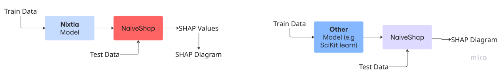

<frontmatter>
layout: default.md
title: "User Guide"
pageNav: 3
</frontmatter>

 

# Architecture Diagram

# Class Diagram

<mermaid>
classDiagram

class NaiveSHAP {
+forecaster
-bg_full
+feature_names_num
-bg_means_num
+futr_exog_list
-shap_cache
-model_group
+predict_fn
+expected_value
+original_output
-hash_dataframe(df) str
+shap_values() pd.DataFrame
+process_explanation() pd.DataFrame
+explain_single(index) pd.Series
+plot_beeswarm()
+plot_waterfall(index, max_display)
}

class ModelGroup {
+predict_fn()\*
+expected_value() float\*
+original_output() np.ndarray\*
}

class MLForecastGroup {
+predict_fn()
+expected_value() float
+original_output() np.ndarray
}

class NeuralForecastGroup {
+predict_fn()
+expected_value() float
+original_output() np.ndarray
}

class ModelGroupFactory {
+create(forecaster, background_data, feature_names, model_key, model_idx) ModelGroup
}

class Plotter {
+beeswarm(shap_df, feature_values, title)
+waterfall(contrib, baseline, title, max_display)
}

MLForecastGroup --|> ModelGroup
NeuralForecastGroup --|> ModelGroup
ModelGroupFactory ..> ModelGroup
NaiveSHAP --> ModelGroupFactory
NaiveSHAP --> Plotter
</mermaid>

# Sequence Diagram

<mermaid>

sequenceDiagram
participant User
participant NaiveSHAP
participant ModelGroupFactory
participant ModelGroup
participant Plotter

    User ->> NaiveSHAP: initialize(forecaster, background_data, ...)
    NaiveSHAP ->> ModelGroupFactory: create(forecaster, background_data, feature_names, ...)
    ModelGroupFactory -->> NaiveSHAP: ModelGroup

    User ->> NaiveSHAP: process_explanation()
    NaiveSHAP ->> NaiveSHAP: _hash_dataframe()
    alt Cache Miss
        NaiveSHAP ->> NaiveSHAP: shap_values()
        NaiveSHAP ->> ModelGroup: predict_fn()
    end
    NaiveSHAP -->> User: SHAP DataFrame

    User ->> NaiveSHAP: explain_single(index)
    NaiveSHAP -->> User: Feature contributions for one instance

    User ->> NaiveSHAP: plot_beeswarm()
    NaiveSHAP ->> Plotter: beeswarm(shap_df, feature_values)

    User ->> NaiveSHAP: plot_waterfall(index)
    NaiveSHAP ->> Plotter: waterfall(contrib, baseline)

</mermaid>
