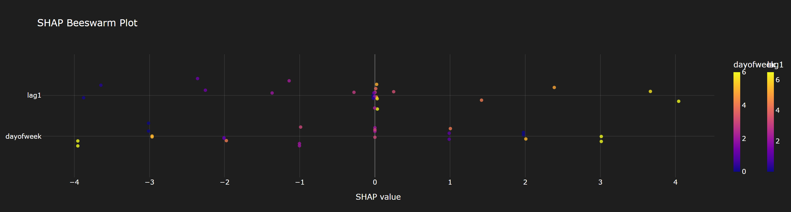
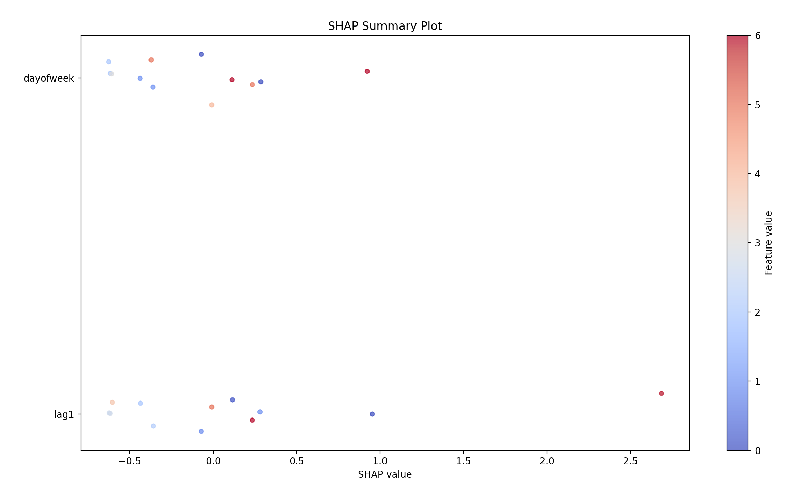
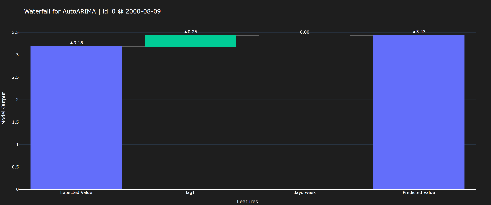
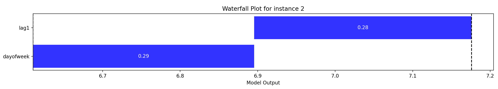

<frontmatter>
  title: Home Page
  layout: default.md
  pageNav: 4
  pageNavTitle: "Topics"
</frontmatter>

<br>

# Project Introduction

Black box models have achieved remarkable predictive performance but are difficult for users and stakeholders to trust, audit, or understand their decisions.

SHAP (SHapley Additive exPlanations) provides a unified, game-theoretic approach to interpreting the output of machine learning models.

While there exists SHAP libraries, internal literature review has shown it to be overly complex for development with Nixtla time series forecasting models.

## Project Objective

This project implements a lightweight and efficient **Naive SHAP framework** tailored for:

- **MLForecast** models
- **NeuralForecast** models

It enables users to:

- Compute approximate SHAP values using a simple leave-one-out methodology
- Visualize feature attributions with **beeswarm** and **waterfall** plots
- Support both tabular and time-series explainability out-of-the-box

## Project Results

A demo run can be found in `main.py`.

The demo run uses a synthetic time series dataset consisting of two exogenous features: `lag1` and `dayofweek`. A `Neuralforecast` and `Statsforecast` models have been trained
using this data. A forecast of 12 weeks have been made using each of these models.

The `NaiveShap` class have been applied to both these models for explanability of the 12 week forecast.

A summary of all SHAP results, a visualisation of this in a beeswarm plot, a point SHAP value and a visualisation of this in a waterfall plot.

#### Summary Table

Summary table for Statsforecast:

|      lag1 | dayofweek | expected_value | model_output |
| --------: | --------: | -------------: | -----------: |
|   1.09157 | -0.690336 |        3.20664 |      3.60788 |
| -0.903754 |   -1.0217 |        3.20664 |      1.28119 |
| -0.580055 |  0.966471 |        3.20664 |      3.59306 |
| -0.180767 |  0.635109 |        3.20664 |      3.66098 |
|  0.019789 |  0.303748 |        3.20664 |      3.53018 |
|  0.360676 | -0.027613 |        3.20664 |       3.5397 |
|  0.792873 | -0.358975 |        3.20664 |      3.64054 |
|   1.12249 | -0.690336 |        3.20664 |      3.63879 |
| -0.875028 |   -1.0217 |        3.20664 |      1.30991 |
| -0.601455 |  0.966471 |        3.20664 |      3.57166 |
|  -0.24378 |  0.635109 |        3.20664 |      3.59797 |
| -0.002562 |  0.303748 |        3.20664 |      3.50783 |

Summary table for Neuralforecast:

|      lag1 | dayofweek | expected_value | model_output |
| --------: | --------: | -------------: | -----------: |
|   2.68699 | -0.371672 |        6.61011 |      8.92543 |
|  0.953304 |  0.923213 |        6.61011 |      8.48663 |
|  0.280486 |  0.285348 |        6.61011 |      7.17594 |
| -0.358947 |  -0.36155 |        6.61011 |      5.88961 |
| -0.617479 | -0.617519 |        6.61011 |      5.37511 |
| -0.604425 | -0.608278 |        6.61011 |      5.39741 |
| -0.008786 |  -0.00883 |        6.61011 |      6.59249 |
|  0.234525 |   0.23445 |        6.61011 |      7.07908 |
|  0.115354 |  0.112267 |        6.61011 |      6.83773 |
| -0.072381 | -0.071341 |        6.61011 |      6.46639 |
| -0.436153 | -0.438409 |        6.61011 |      5.73555 |
| -0.623792 | -0.626381 |        6.61011 |      5.35994 |

#### Beeswarm plot

Beeswarm plot for Statsforecast


Beeswarm plot for Neuralforecast


#### Point SHAP value

Point table for Statsforecast:

|      lag1 | dayofweek |
| --------: | --------: |
| -0.580055 |  0.966471 |

Point table for Neuralforecast:

|     lag1 | dayofweek |
| -------: | --------: |
| 0.280486 |  0.285348 |

#### Waterfall Plot

Waterfall plot for Statsforecast


Waterfall plot for Neuralforecast


## Benchmark Testing

The internal SHAP implementation has been benchmarked against the [standard SHAP library](https://shap.readthedocs.io/en/latest/). The preparation for the test follows the procedure outlined in the [Nixtla documentation](https://nixtlaverse.nixtla.io/mlforecast/docs/how-to-guides/analyzing_models.html).

Using a paired t-test, and assuming an alternate hypothesis that the SHAP values output by the internal implementation is different from the standard SHAP implementation, we find a p-value as listed in this table:

|               model | p-value |
| ------------------: | ------: |
|   Linear Regression |  0.9264 |
|               Ridge |  0.9264 |
|               Lasso |  0.9239 |
| KNeighborsRegressor |  0.6865 |
|          ElasticNet |  0.9199 |

We do not reject the null hypothesis at 1% significance level.

The test may be run from the root of the folder using the following command:

```
python -m unittest
```

## Sanity Check

A sanity test of neural forecast has been done. A group of five neural forecast models from **
Nixtla** are trained on the same dataset. The NaiveSHAP has been used to explain the second data point in the testing dataset. The following table lists the model and the corresponding SHAP values of the given features

|  model |      lag1 | dayofweek |     Expected Value |          Actual Value |
| -----: | --------: | --------: | -----------------: | --------------------: |
|  NHITS |  0.289143 |  0.289143 |  6.075912952423096 |     6.654199123382568 |
| NBEATS | -0.128028 | -0.128028 |  5.472932815551758 |     5.216876983642578 |
|    RNN | -0.011475 | -0.011475 | 3.1893014907836914 |     3.166351318359375 |
|    TCN | -0.006551 | -0.006551 | 3.2793445587158203 |    3.2662432193756104 |
|  BiTCN |  0.002067 |  0.002067 | -0.021012082695961 | -0.016878139227628708 |

## Future Work

- Integrate faster approximation methods (e.g., KernelSHAP-like sampling)
- SHAP for multi-output models
